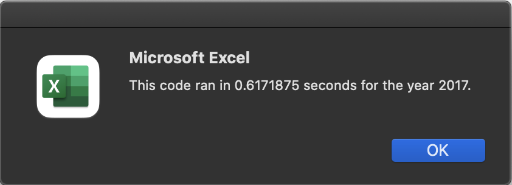
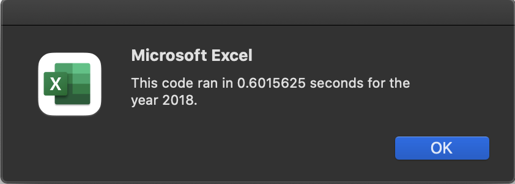
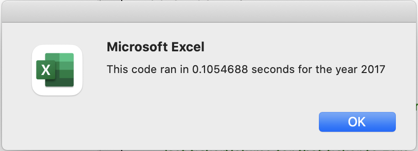
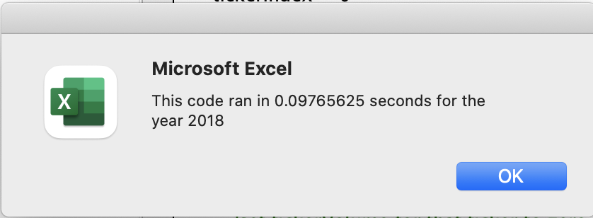

# stock-analysis

## Project Overview

### Purpose
The purpose of this project is to refactor the code that was used to analyze the green stocks in order to make it more efficient - that is, to see if it will run faster and use less memory. The VBA code I wrote to analyze the DQ stock and then the 12 green stocks is adequate for this small amount of data, but if I ever wanted to use this code to analyze a larger dataset, it would be nice to have code that could do the analysis more quickly.

### Summary of Initial Code
The first bit of code I wrote to analyze all of the green stocks uses two nested for-loops. The outer loop stepped through the array of 12 different stocks to be analyzed. The inner loop cycled through all of the rows in the spreadsheet, checked to see if the ticker for that row matched the stock ticker that the outer for loop is iterating through, if so, increased the total volume of the stock by the amount stored in that row. The inner for-loop also included code to check to find the first and last row of this stock data to set the stock beginning and ending value. Finally, the data is output onto the Analysis worksheet before moving on to the next ticker value in the array. The structure of this code is:

1. Set start & end time variables, and collect year value with input box.  
2. Activate "All Stocks Analysis" worksheet and format output headers. 
3. Initialize the array of all tickers. 
4. Prepare for analysis of tickers.  
   - initialize variables for starting price and ending price.  
   - Activate the data worksheet.  
   - Find the number of rows to loop through
5. Loop through the tickers.  
   - Loop through the rows of data.  
        * Find the total volume for the current ticker.   
        * Find the starting price for the current ticker.  
        * find the ending price for the current ticker.  
   - Output the data for the current ticker

### Improvements to the Code
The biggest change to the code is the use of Arrays to store the output data (Total Daily Volume, Stock Starting Prices and Stock Ending Prices (used to calculate % change)) which eliminated the need to cycle through the stock data more than once and also eliminated the need to activate the Output Worksheet more than once. The refactored code also included the formatting as a part of the analysis code rather than as a separate macro.

The structure of the refactored code is:  
1. Set start & end time variables, and collect year value with input box.  
2. Activate "All Stocks Analysis" worksheet and format output headers. 
3. Initialize the array of all tickers.  
4. Prepare for analysis of tickers.  
   - Initialize arrays to hold total volume, starting price, and ending price for each ticker.   
   - Activate the data worksheet.   
   - Find the number of rows to loop through
5. For loop to set initial volumes in total volume array equal to zero.
6. Loop through the rows once to collect total volume, starting value, and ending value for each ticker and store in the appropriate output array.
7. Output data for all tickers

## Results

### Run Time For Original Code
The initial code for AllStocksAnalysis() ran in 0.6171875 seconds for the year 2017 and 0.6015625 seconds for the year 2018.

### Run time for Refactored Code
The refactored code for AllStocksAnalysisRefactored ran in 0.1054688 seconds for 2017 and 0.09765625 seconds for 2018.

## Summary

The small changes to the code made a big difference in the speed of analysis. According to our one data point, the refactored code was able to complete the analysis on the 2017 data 585% faster than the original code (0.1054688 vs 0.6171875 seconds), while the 2018 data was analyzed 616% faster (0.9765625 vs 0.6015625 seconds).

There are pros and cons to refactoring code. The major advantage is that refactored code can be more efficient, cleaner, and elegant than the original code. The code can be refined in the refactoring process to be as fast as possible. The downside is that it can take a significant amount of time to go through the code to refactor it. 

For a dataset this small, the time it took to re-write the code does significantly outweigh the amount of time saved (~ half a second) so it was not worth the refactoring. However, as previously mentioned, if this same code were to be used on a much larger dataset, or on multiple datasets, then the effort put into refactoring the code becomes more worth it.

### Recommended Further Analysis
If we wanted to have a better idea of just how much faster the refactored code is then we need more data points. I recommend writing a macro to iterate 100 times through each of the two years of stock data with the old code and the refactored code then calculate the average time required to run the new and the old code and use those values to more accurately determine how much faster the new code is vs the old code. 
